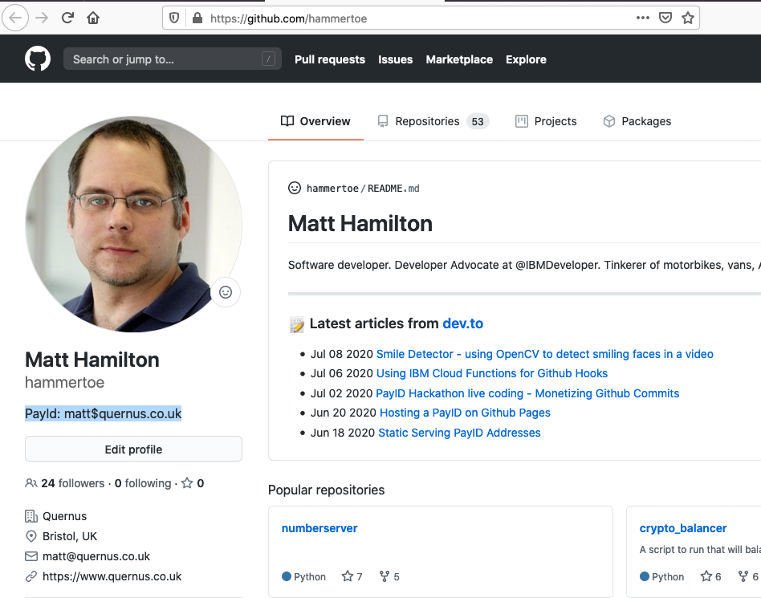
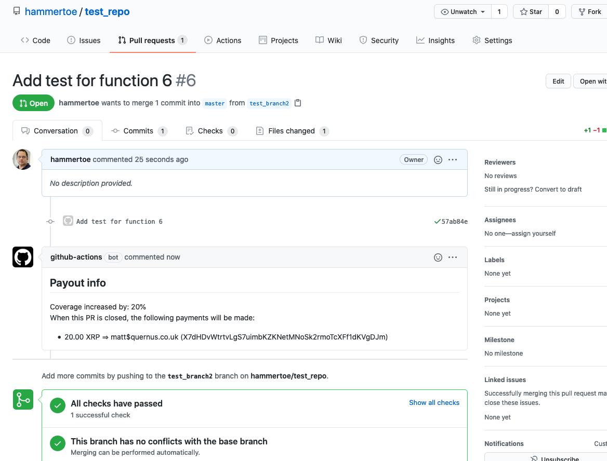
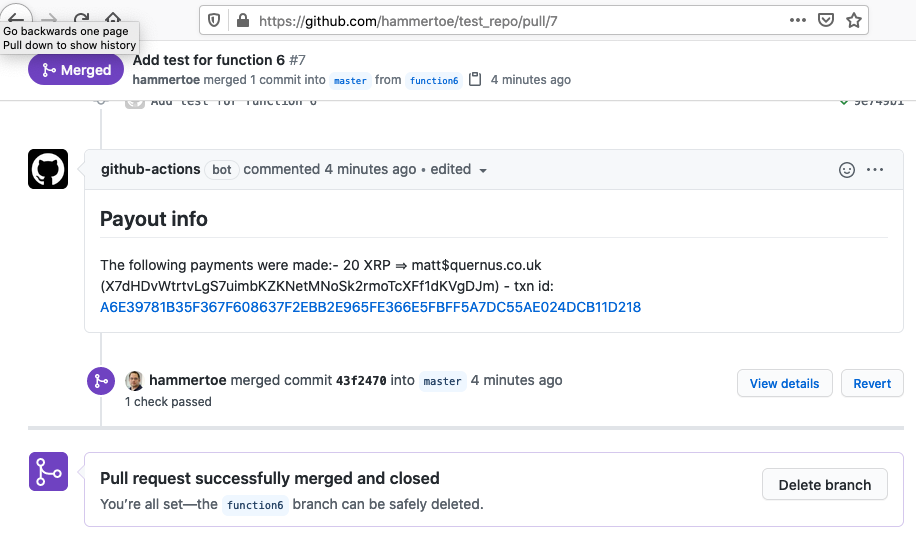
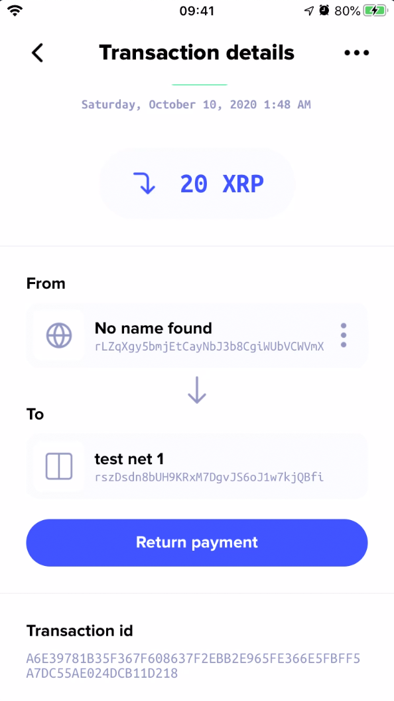

# payid_xrp_pr_coverage_action

## What?
A Github Action that pays a contributor in XRP for pull requests that
increase the test code coverage of a repo

The idea is to incentivise testing and improve code quality

The address to send the payment to is looked up via [PayIds](https://payid.org/) 
from the PR opener's bio on Github.

When a PR is opened then the action checks the openers profile bio and looks for a PayID:



The action then puts a comment in the PR having resolved the PayID to an XRP address
and calculated how much XRP to pay them based on increase in code test coverage:



The owner of the repo can edit the comment if they like to adjust the amount or
remove/add additional payees.

Once the PR is closed then the action makes the actual payments and comments
on the PR with the XRP Ledger txn id:



Within seconds the payment arrives and the destination wallet:



## How to set it up?

An example workflow:

```yaml
name: PayID PR Coverage Action

on:
  # Trigger the workflow on push or pull request,
  # but only for the master branch
  pull_request:
    branches:
      - master

jobs:
  pay:

    runs-on: ubuntu-latest

    steps:
    - name: Set up Python
      uses: actions/setup-python@v2
      with:
        python-version: '3.x'
        
    - name: Install testing
      run: |
        python -m pip install --upgrade pip
        pip install pytest pytest-cov

    - name: Checkout prior code  
      uses: actions/checkout@v2
      with:
        ref: ${{ github.event.pull_request.base.sha }}
        path: .old-code

    - name: Install old code dependencies
      run: |
        cd .old-code
        if [ -f requirements.txt ]; then pip install -r requirements.txt; fi
        cd ..

    - name: Run tests on old code
      run: |
        cd .old-code
        pytest --cov-report=xml --cov=foo test.py
        cd ..

    - name: Checkout current code  
      uses: actions/checkout@v2
      with:
        ref: ${{ github.event.pull_request.head.sha }}
        path: .new-code

    - name: Install new code dependencies
      run: |
        cd .new-code
        if [ -f requirements.txt ]; then pip install -r requirements.txt; fi
        cd ..

    - name: Run test on new code
      run: |
        cd .new-code
        pytest --cov-report=xml --cov=foo test.py
        cd ..

    - name: Run PayID
      uses: hammertoe/payid_xrp_pr_coverage_action@master
      with:
        repo_token: ${{secrets.GITHUB_TOKEN}}
        wallet_secret: ${{ secrets.PAYID_WALLET_SECRET }}
        old_coverage_file: /home/runner/work/test_repo/test_repo/.old-code/coverage.xml
        new_coverage_file: /home/runner/work/test_repo/test_repo/.new-code/coverage.xml

```

The above workflow will run a pytest code coverage over both the new and old code
when a new PR is opened or synchornised. It will then add a comment to the PR
stating who will be paid (having looked up the PayID in the committer's bio on Github)

## Parameters

The action takes the following input parameters:

```yaml
inputs:
  wallet_secret:
    descrption: 'The secret key of the XRP wallet to pay from'
    required: true
  max_payout: 
    description: 'Maximum number of drops to pay out'
    default: 100000000
  environment:
    description: 'Environment to use, TESTNET or LIVENET'
    default: 'TESTNET'
  server:
    description: 'XRP Ledger server to use'
    default: 'test.xrp.xpring.io:50051'
  dry_run:
    description: 'Dry run. Do not actually make payment, but report what would be done'
    default: true
  repo_token:
    description: 'Repository token'
    required: true
  old_coverage_file:
    description: 'Old code coverage file'
    required: true
    default: .old-code/coverage.xml
  new_coverage_file:
    description: 'New code coverage file'
    required: true
    default: .new-code/coverage.xml
```

Note above: by default this runs on the XRP TESTNET, you need to set the `environment` input parameter
to `LIVENET` and set the correct production server in `server` order to make payments on the live network. 